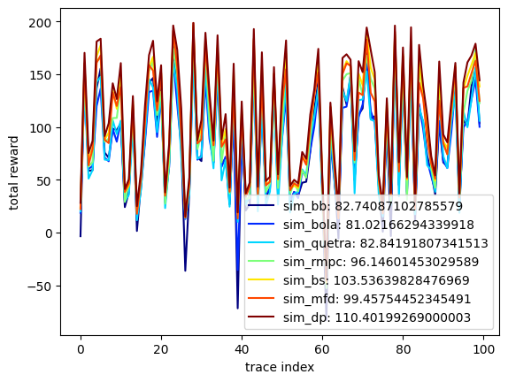

# SABR

[中文 README](./README_CN.md)

**SABR (Stable Adaptive Bitrate)** is a learning framework for adaptive bitrate (ABR) decision-making. SABR adopts a **two-stage training paradigm: Pretraining + Fine-tuning**:

1. **Behavior Cloning (BC) Pretraining**  
   - Trained on demonstration data generated by expert policies (e.g., MPC with beam search), using **DPO (Direct Preference Optimization)** for efficient and stable imitation learning.  
2. **Reinforcement Learning (RL) Fine-tuning**  
   - Starting from the pretrained model, applies **PPO (Proximal Policy Optimization)** for deeper exploration and policy improvement.  


## Prerequisites

- OS: **Ubuntu / CentOS**  
- Python: **3.10**
- Install dependencies:
  ```bash
  pip install -r requirements.txt
  ```


## Dataset: ABRBench

1. Download **[ABRBench](https://github.com/luopeng69131/ABRBench)**.  
2. Place the unpacked folder in the project root and **keep the name exactly `ABRBench`** (the path must be `./ABRBench`). Example:
   ```
   SABR/
   ├── ABRBench/              # dataset folder name must be exactly this
   ├── build_env_c_plus/
   ├── config.py
   ├── train_sabr.py
   └── ...
   ```


## Train & Evaluate: SABR

### Step 1 — Prepare the dataset
See the section above: **Dataset: ABRBench**.

### Step 2 — Configure dataset options
- In **`config.py`**, set `_DATASET` to one of:
  - `ABRBench-3G`, or  
  - `ABRBench-4G+`
- In **`build_env_c_plus/config.h`**, set `DATASET_OPTION` to:
  - `20` (for the `ABRBench-3G` mixed suite), or  
  - `30` (for the `ABRBench-4G+` mixed suite)

### Step 3 — Rebuild the C++ environment
Recompile after every change to `config.h`:
```bash
cd build_env_c_plus
bash build_all.sh
```

### Step 4 — Train and auto-evaluate
```bash
python train_sabr.py
```
After training, the script will **automatically** evaluate on each **test set** and **OOD set**, and write out the results.


## Learning-based Baselines: Comyco & Pensieve

**Steps 1/2/3** are the same as SABR (dataset, config, build).

**Step 4 — Train:**
```bash
# Comyco
python train_comyco.py

# Pensieve
python train_pensieve.py
```
After training, each baseline is **automatically** evaluated on all **test** and **OOD** sets.


## Rule-based Baselines

Included: **QUETRA / BOLA / BB / RobustMPC**, etc.

- **Step 1** is the same as SABR (prepare the dataset).  
- **Step 2 (important difference)**:  
  Rule-based methods **cannot** select the mixed suites `ABRBench-3G` / `ABRBench-4G+` directly.  
  You **must** choose a **single trace set** and test them one by one.  
  - Example for **FCC-18**:  
    - In `config.py`: set `_DATASET = 'FCC-18'`  
    - In `build_env_c_plus/config.h`: set `DATASET_OPTION = 2`
- **Step 3** is the same as SABR (rebuild after `config.h` changes):
  ```bash
  cd build_env_c_plus
  bash build_all.sh
  ```
- **Step 4 — Run all rule-based baselines:**
  ```bash
  bash ex_rule_baseline.sh
  ```

### Optional: Lower-bound / Oracle-style analyses
These three use **future bandwidth** and serve as **lower bounds** or **optimal solutions** for case studies:
```bash
# 1) Beam-search based lower bound
python run_bs_mpc.py bs

# 2) MPC-based lower bound
python run_bs_mpc.py mfd

# 3) Dynamic programming (dp_my): per-case optimal solution (see Pensieve paper)
./dp_my
```
> Note: `dp_my` may fail on some trace sets (you can skip it if needed).


## QoE Results 

After running rule-based (and learning) methods, use the plotting script to compare QoE across schemes. Select which schemes to display via **`SCHEMES`** in `plot_results.py`, then:
```bash
python plot_results.py
```



## FAQ

- **Changed `config.h` but nothing happened?**  
  You need to rebuild:  
  ```bash
  cd build_env_c_plus && bash build_all.sh
  ```
  ⚠️ If you change `config.h` (C++ side) but **do not** update `config.py` accordingly, your **training/evaluation** and **plotting** may use **inconsistent QoE parameters**.

- **Does `plot_results.py` use QoE parameters from `config.py`?**  
  Yes.  
  - `plot_results.py` reads the **bitrate levels** and **rebuffer penalty** for the current `_DATASET`.  
  - These parameters come from the `_DATASET_OPTION` entry in `config.py`.  
  - If you change **`VIDEO_BIT_RATE`** or **`REBUF_PENALTY`** in `config.py`, the QoE values computed by `plot_results.py` will change accordingly.


## References & Acknowledgments
- Implementations / baselines:
  - [pensieve](https://github.com/hongzimao/pensieve)
  - [pensieve_retrain](https://github.com/GreenLv/pensieve_retrain)
  - [comyco-lin](https://github.com/godka/comyco-lin)
  - [merina](https://github.com/confiwent/merina/)
